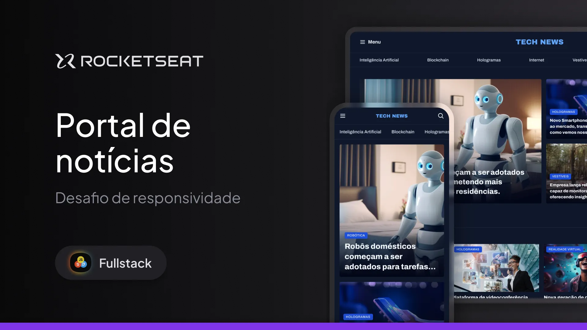

<h1 align="center">Portal de Notícias</h1>

Este projeto faz parte do curso Fullstack da Rocketseat. Ele foca na exploração do conceito de GRID. Este projeto também fez parte do desafio de responsividade onde foi adaptado para dispositivos mobile usando mediaquery.

  <a href="#-tecnologias">Tecnologias</a>&nbsp;&nbsp;&nbsp;|&nbsp;&nbsp;&nbsp;
  <a href="#-projeto">Projeto</a>&nbsp;&nbsp;&nbsp;|&nbsp;&nbsp;&nbsp;

  

 

  

## 🚀 Tecnologias

Este projeto foi desenvolvido com as seguintes tecnologias:

- HTML e CSS  
- Git e GitHub  
- Figma

## 💻 Projeto

O projeto apresenta uma página de notícias.

- [Acesse o projeto finalizado online](https://dev-filipebcs.github.io/News-Portal/)
